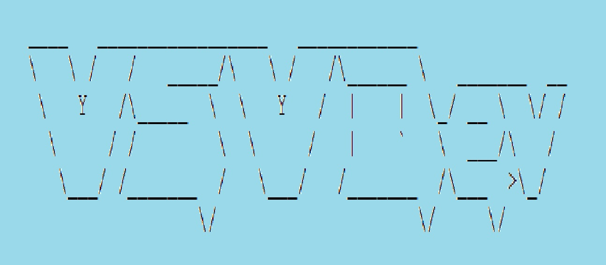
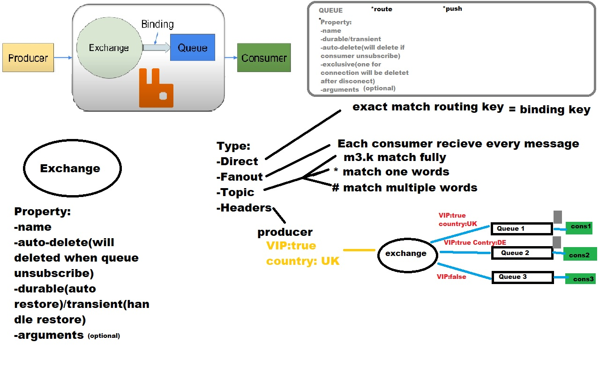

# RabbitMQ Java
### Project contains examples working with RabbitMQ for java developers

-------------------------

## Install

1. download project

2. install rabbit and run;
   
   DOCKER: docker run -d -p 15672:15672 -p 5672:5672 --name rabbitmy -e RABBITMQ_ERLANG_COOKIE='secret cookie here' rabbitmq:3-management
   
   CREDENTIALS: user=guest password=guest
   
   create queue
   http://localhost:15672 (login and password:guest)
  
   
##   First project rabbit_examples [link to folder](rabbit_examples)
   
   ### queue_publisher [link to folder](rabbit_examples/src/main/java/queue_publisher)
   ->Queues->add a new queue-> name: Queue-1; ->add-> near table "+/-" -> consumer count +
     run class Publisher
 
   go to console rabbit click on the Queue-1 and pull "get message"
   run Consumer class -see log and see in rabit console no massages
  
 ### direct_exchange [link to folder](rabbit_examples/src/main/java/direct_exchange)
   create in rabbit -> exchange-> name: "Direct-Exchange"; type: "direct"-> add exchange
   ->Queues->add a new queue-> name: Mobile; 
   ->Queues->add a new queue-> name: TV;
   ->Queues->add a new queue-> name: AC;
  
   go to exchange click on "Direct-Exchange"->Bindings->add bindings-> to: Mobile; Routing key: mobile->bind
   Bindings->add bindings-> to: TV; Routing key: tv->bind
   Bindings->add bindings-> to: AC; Routing key: ac->bind
   run class DirectPublisher
   run class DirectConsumer
 
 ### fanout_exchange [link to folder](rabbit_examples/src/main/java/fanout_exchange)
   create in rabbit -> exchange-> name: "Fanout-Exchange"; type: "fanout"-> add exchange
   ->Queues->add a new queue-> name: Mobile1; 
   ->Queues->add a new queue-> name: AC1;
   
   go to exchange click on "Fanout-Exchange"->Bindings->add bindings-> to: Mobile1; ->bind
   Bindings->add bindings-> to: AC1; ->bind
   run class FanoutPublisher
   run class FanoutConsumer
  
   ### topic_exchange [link to folder](rabbit_examples/src/main/java/topic_exchange)
   create in rabbit -> exchange-> name: "Topic-Exchange"; type: "topic"-> add exchange
   ->Queues->add a new queue-> name: Mobile2; 
   ->Queues->add a new queue-> name: TV2;
   ->Queues->add a new queue-> name: AC2;
   
   go to exchange click on "Topic-Exchange"->Bindings->add bindings-> to: AC2; Routing key: #.ac->bind
   Bindings->add bindings-> to: TV2; Routing key: *.tv.*->bind
   Bindings->add bindings-> to: Mobile2; Routing key: *.mobile.*->bind
   run class TopicPublisher(recive only Mobile2; AC2)
   run class TopicConsumer
   
  ### header_exchange [link to folder](rabbit_examples/src/main/java/header_exchange)
   create in rabbit -> exchange-> name: "Headers-Exchange"; type: "topic"-> add exchange
   ->Queues->add a new queue-> name: Mobile3; 
   ->Queues->add a new queue-> name: TV3;
   ->Queues->add a new queue-> name: AC3;
   
   go to exchange click on "Headers-Exchange"->Bindings->add bindings-> to: Mobile3
   Arguments: 
   x-match=any
   item1 = mobile
   item2=mob->bind
   ---
   Bindings->add bindings-> to: TV3;
   Arguments: 
   x-match=any
   item1 = tv
   item2=television->bind  
   ---
   Bindings->add bindings-> to: AC3;
   Arguments: 
   x-match=all
   item1 = mobile
   item2=ac->bind  
   run HeadersPublisher(recieve only  Mobile3;  TV3;)
   run HeadersConsumer
   
   
  ### real_queue_publisher(with JSON) [link to folder](rabbit_examples/src/main/java/real_queue_publisher)
   run class RealTimeExample -> run class Consumer
   
 ## Second project Spring boot [link to folder](spring_rabbit)
   create queue
   http://localhost:15672 (login and password:guest)
  
 ### query
   ->Queues->add a new queue-> name: Mob; ->add-> near table "+/-" -> consumer count +
   run spring boot app and go to http://localhost:8080/api/v1/test/Joe
   
 ###  direct_exchange
   create in rabbit -> exchange-> name: "DExchange"; type: "direct"-> add exchange
   ->Queues->add a new queue-> name: Mobb; 
   ->Queues->add a new queue-> name: TVV;
   ->Queues->add a new queue-> name: ACC;
  
   go to exchange click on "DExchange"->Bindings->add bindings-> to: Mobb; Routing key: mobile->bind
   Bindings->add bindings-> to: TVV; Routing key: tv->bind
   Bindings->add bindings-> to: ACC; Routing key: ac->bind
   
 ###  fanout
   create in rabbit -> exchange-> name: "FExchange"; type: "fanout"-> add exchange
   ->Queues->add a new queue-> name: Mobb1; 
   ->Queues->add a new queue-> name: ACC1;
  
   go to exchange click on "FExchange"->Bindings->add bindings-> to: Mobb1; ->bind
   Bindings->add bindings-> to: ACC1; ->bind
   
### topic
   create in rabbit -> exchange-> name: "TExchange"; type: "topic"-> add exchange
   ->Queues->add a new queue-> name: Mobb2; 
   ->Queues->add a new queue-> name: TVV2;
   ->Queues->add a new queue-> name: ACC2;
  
   go to exchange click on "TExchange"->Bindings->add bindings-> to: ACC2; Routing key: #.ac->bind
   Bindings->add bindings-> to: TVV2; Routing key: *.tv.*->bind
   Bindings->add bindings-> to: Mobb2; Routing key: *.mobile.*->bind
   run class TopicPublisher(recive only Mobb2; AC2)
   *********************
   run spring boot app and go to http://localhost:8080/api/v1/test/Joe
   
### header 
   create in rabbit -> exchange-> name: "HExchange"; type: "topic"-> add exchange
   ->Queues->add a new queue-> name: Mobb3; 
   ->Queues->add a new queue-> name: TVV3;
   ->Queues->add a new queue-> name: ACC3;
  
   go to exchange click on "HExchange"->Bindings->add bindings-> to: Mobb3
   Arguments: 
   x-match=any
   item1 = mobile
   item2=mob->bind
   ---
   Bindings->add bindings-> to: TVV3;
   Arguments: 
   x-match=any
   item1 = tv
   item2=television->bind  
   ---
   Bindings->add bindings-> to: ACC3;
   Arguments: 
   x-match=all
   item1 = mobile
   item2=ac->bind  
   ***test
   
   run spring boot app and go to http://localhost:8080/api/v1/test/Joe

 ## Third project Spring MVC [link to folder](spring_mvc)
 
instructions as for the previous one only start project with tomcat

## Fourth project [link to folder](spring_cloud)
 You need account in Pivotal Cloud Foundry 
 for work with rabbit wich there
 
## Fifth pproject [link to folder](spring_cloud_peclf)
 project ready to deploy to Pivotal Cloud Foundry 
